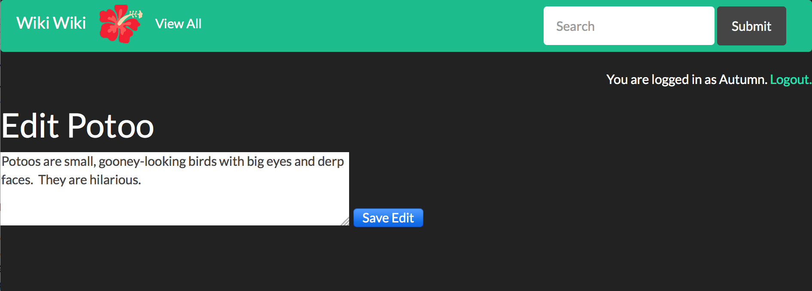

#Wiki

This is a 90s style, toy wiki.  It was built using Python, the Flask web application framework, and the PostgreSQL database.
  

 
**Welcome screen for logged in user.**

###Criteria:
* Database in PostgreSQL
* Placeholder page
* Creating and editing pages restricted to logged-in users
* Flash messages 
* Sign-up page
* Search function

 
**Wiki database design.**  

 
**Flash message indicating invalid login.**  

 
**Editing entry.**  

 
**Sample entry page.**  

